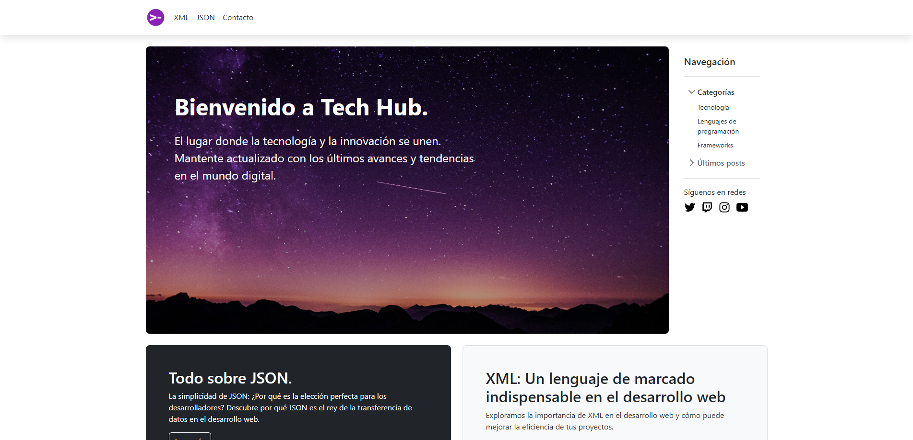
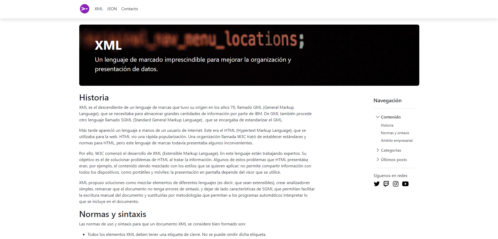
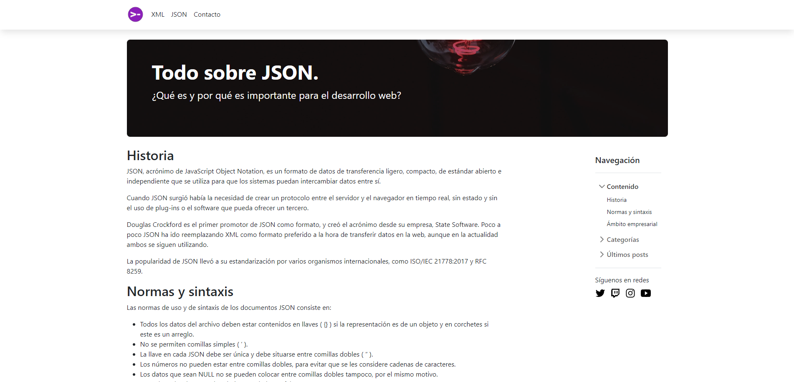
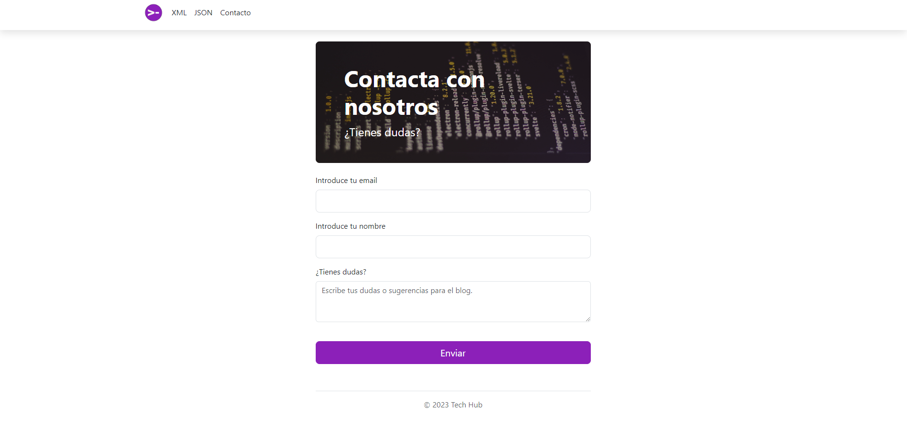

<!--
- **bold** and _italics._
- lists
- [links](https://astro.build)
- and more!
 -->

Consulta el proyecto en el siguiente enlace: <a href="https://proyecto-1-eloy6lega.firebaseapp.com/" target="_blank" >https://proyecto-1-eloy6lega.firebaseapp.com/</a> 
 

O descárgalo en mi github: <a href="https://github.com/eloy6lega/TechHub" target="_blank" >https://github.com/eloy6lega/TechHub</a> 
 

También puedes ver la memoria del proyecto haciendo click en el siguiente botón: 
 

<button style="width: 50px; height: 50px">
  
</button> 
 
<!-- <button style="width: 50px; height: 50px">
  
</button> 
  -->

Este proyecto está realizado para la asignatrura de "Lenguaje de Marcas" (Primer año del grado).

Es una web informativa que trata sobre JSON y XML. Contiene la información necesaria para saber qué es. 
 

También tiene elementos y caracterísiticas de HTML5 y CSS3 que causa que nuestra web sea atractiva visualmente. 
 

 

<!--   -->

Tenemos información sobre XML, tanto su **historia** como sus **normas y sintaxis** o como **Aplicaciones del XML en el ámbito empresarial**. 
 

 

<!--   -->
 

Al igual, también está sobre **JSON**. Su **historia**, **normas y sintaxis** y **Aplicaciones del XML en el ámbito empresarial**. 
 

 

<!--   -->
 

Por último, tenemos un **formulario de contacto** por si el cliente tiene dudas. Simplemente introduciendo su _email_, _nombre_ y _sus dudas_ podría comunicarse con nosotros para que le podamos ayudar en medida de lo posible. 
 

 

<!--   -->
 
